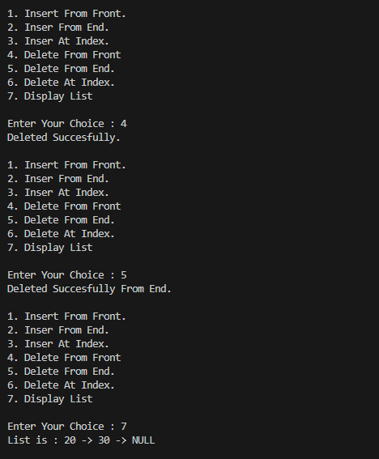

# Sorting & Searching Algorithms in C++

This C++ program demonstrates classic **sorting and searching algorithms**—including **Merge Sort**, **Quick Sort**, and **Binary Search**—in a simple **menu-driven application**. It allows users to input an array, choose a sorting method, and then search for an element using Binary Search.

## 📌 Features

- 📥 User-defined input array
- 🔀 Sorting Options:
  - Merge Sort (Divide and Conquer)
  - Quick Sort (Efficient, In-Place Sorting)
- 🔎 Binary Search (on the sorted array)
- 🧾 Array Display Before and After Sorting
- 🧠 Simple CLI-based Menu System

---

## 🛠️ Technologies Used

- C++
- Standard Template Library (STL): `vector`
- Basic I/O via `iostream`

---

## Sorting And Searching

1. Merge Sort

2. Quick Sort

## Features
Insert node at the front

Insert node at the end

Insert node at a specific index

Delete node from the front

Delete node from the end

Delete node at a specific index

Display the current list

## Code Overview
Class Node: Represents a single node in the list.

Class LinkedList: Contains functions for list operations.

Main Function: Provides a menu-driven loop for user interaction.

## LINKED LIST

1. Inserting 

2. display

2. Deleting
